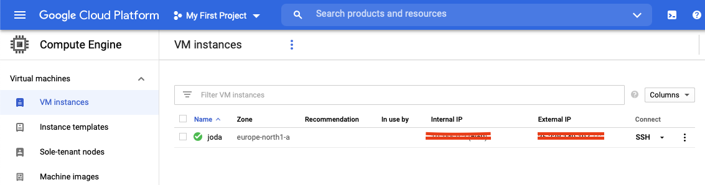
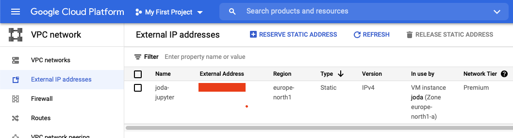
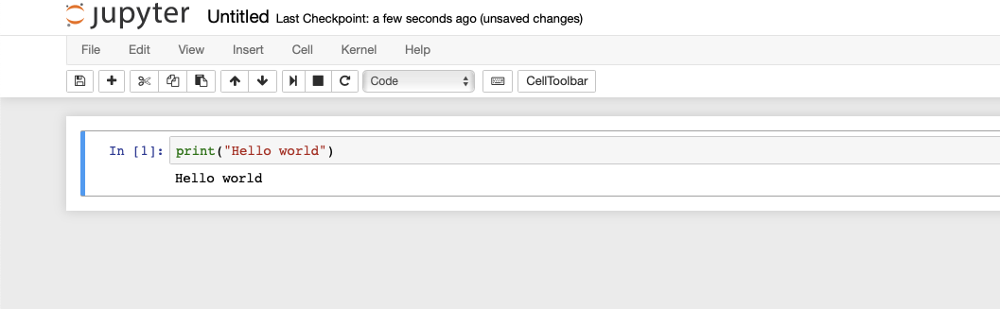

# Harjoitustyö 1: Kehitysympäristö
### *Ilpo Viertola, Johdanto datatieteeseen 2021*

## Google Cloud Platform
Päätin toteuttaa työn kehitysympäristön hyödyntäen Google Cloud Platformia. GCP vaatii Google-tilin ja sinne ensi kertaa kirjautuessa uudet käyttäjät saavat käyttöönsä 300$. Käytin apuna [täältä löytyvää ohjetta.](https://tudip.com/blog-post/run-jupyter-notebook-on-google-cloud-platform/). Käydään kuitenkin pääkohdat läpi tässä:

1. Kirjautumisen jälkeen tulee luoda uusi virtuaalikone instanssi *Compute engine -kohdasta*. Alla kuva VM:n asetuksista:
<p style="text-align:center;"><p />

2. Tämän jälkeen luotu VM näkyy vastaavanlaisesti:
<p style="text-align:center;"><p />

3. Vaihdetaan virtuaalikoneen IP-osoite staattiseksi. Tämä helpottaa sen käyttöä, kun ei aina tarvitse onkia uutta IP-osoitetta. Tietysti tietorurvallisempaa olisi käyttää dynaamista IP-osoitetta...
<p style="text-align:center;"><p />

4. Muutetaan palommuriasetuksia:
    - Klikkaa VM-instanssin perästä kolmesta pisteestä -> network details
    - Vasemmalta valikosta Firewall -> Create firewall rule
    - Määritä IP, josta yhteydet sallitaan
    - Määritä TCP porttinumero (esim. 5002), johon yhteydet sallitaan

5. Käynnistetään SSH-yhteys virtuaalikoneelle. Seuraava näkymä aukeaa selaimeen:
<p style="text-align:center;"><p />

6. Asennetaan Anaconda virtuaalikoneelle. Sen mukana tulee myös muita hyödyllisiä Python-paketteja, kuten Jupyter Notebook, Pandas yms. Tämä onnistuu komennolla:
```
wget https://repo.continuum.io/archive/Anaconda3-4.2.0-Linux-x86_64.sh
bash Anaconda3-4.2.0-Linux-x86_64.sh
```

7. Luodaan ja avataan Jupyter Notebook konfigurointi tiedosto. Tämä onnistuu esim VIM-editorilla.
```
jupyter notebook --generate-config
vim ~/.jupyter/jupyter_notebook_config.py
```

8. Lisätään siihen rivit:
```
c = get_config()
c.NotebookApp.ip = '*'
c.NotebookApp.open_browser = False
c.NotebookApp.port = <PORTTI-NRO-KOHDASTA-4>
```

9. Käynnistetään Jupyter Notebook serveri virtuaalikoneella:
```
jupyter notebook
```

10. Siirry selaimella osoitteeseen: http//:<VM:n IP-osoite>/<määritetty portti>. Luo uusi Jupyter Notebook -tiedosto. Alla kuva omasta ympäristöstäni:
<p style="text-align:center;"><p />

## Versionhallinta ja koodien jakaminen
Käytetään versionhallintaan ja koodien jakamiseen Git:iä ja GitHubia. Koska Git:n käyttö ei kurssin ydinasiaan liity, en käy sitä tarkemmin. Gitin asennusohjeet komentoriviltä löytyvät kuintekin [git-scm.com sivulta.](https://git-scm.com/book/en/v2/Getting-Started-Installing-Git) Enemmän ohjeita löytyy esimerkiksi [täältä.](https://docs.github.com/en/github/getting-started-with-github/quickstart)

## Hyödyllisien linkkien yhteenveto
1. [GCP-ohjeet](https://tudip.com/blog-post/run-jupyter-notebook-on-google-cloud-platform/)
2. [Gitin asennus](https://git-scm.com/book/en/v2/Getting-Started-Installing-Git)
3. [Git ohjeita](https://docs.github.com/en/github/getting-started-with-github/quickstart)


## Helppoa ja vaikeaa
1. Asiat olivat ennestään tuttuja, joten vaikeuksia ei ollut.
2. Tietoa löytyy runsaasti netistä.
3. GCP palvelu on helppo käyttöinen.