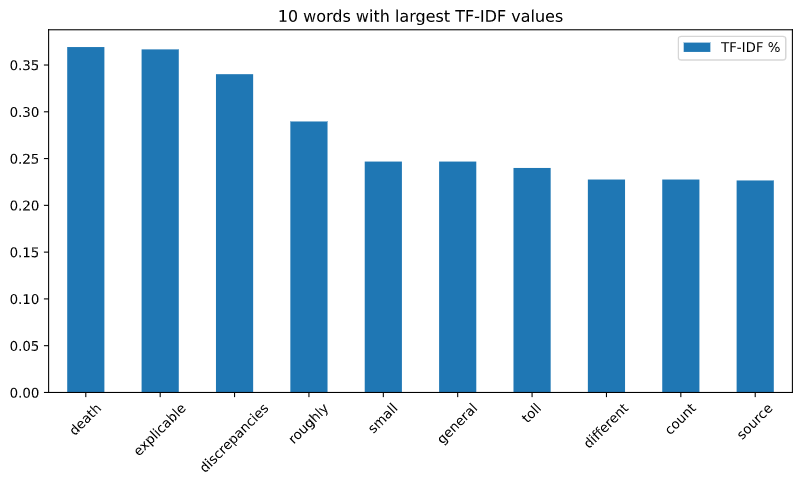
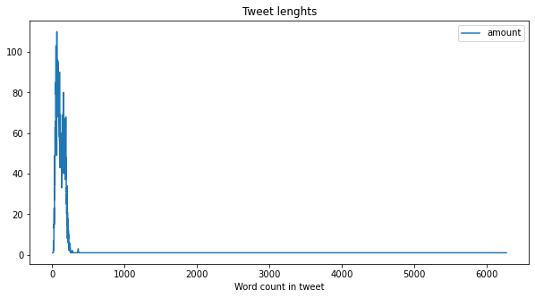
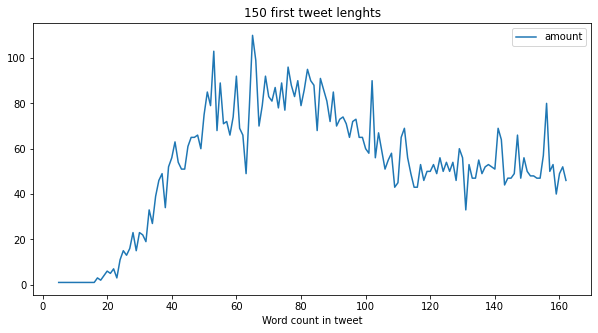
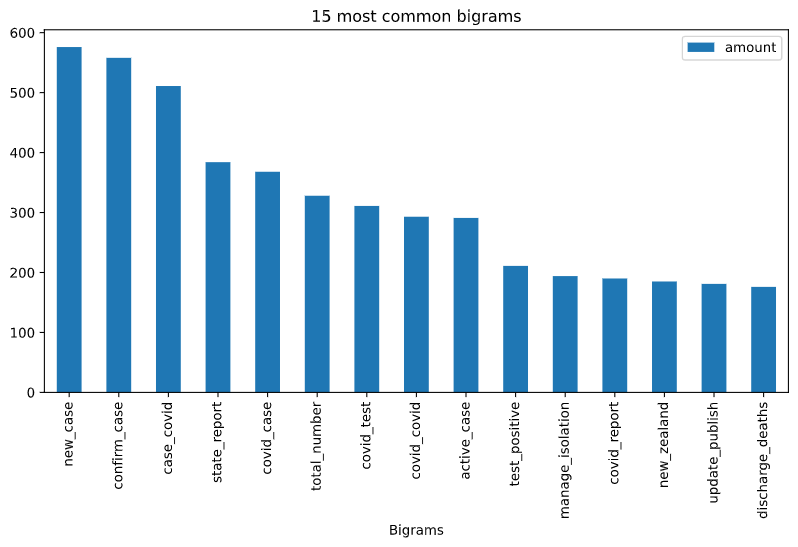

# Harjoitustyö 3: Datan jalostaminen
### *Ilpo Viertola, Johdanto datatieteeseen 2021*  

Tässä harjoitustyön osassa otetaan lyhyt katsaus käytettyihin datasetteihin. Tässä raportissa olevat kuvaajat ovat muodostettu yhdistetylle datasetille, joka sisältää kaikki twiitit. Datan kuvaileminen on erityisen tärkeää myös NLP-työssä. Tämä auttaa vahvistamaan tulokset siitä, että datan esikäsittely on oikeasti onnistunut ja esimerkiksi kaikki poikkeamat, jotka on haluttu teksteistä poistaa, ovat oikeasti poissa. Myös usein esiintyvät sanat ovat kiinnostavia. Tätä silmäilyä varten yhdistin kaikki esikäsitellyt twiitit yhdeksi datasetiksi. Tämän datasetin exportoin Excel-taulukoksi, jota silmäilemällä huomasin, että kaikki Emojit eivät olleet poistuneet datasta. Tämän johdosta päivitin datan siivoukseen käyttämääni funktiota ja exportoin twiitit uudestaan varmistuakseni siitä, että siivoaminen oli onnistunut. 

## Sanojen kokonaismäärä

Alla olevassa kuvaajassa on 15 suosituinta sanaa. Suosituin sana on 'covid19', joka ei yllätä sillä datasetit koostuvat koronavirus-uutisista.
```python
print('The total number of words: ', len(tokenizer.word_index) + 1)
word_amnts = pd.DataFrame(columns=['word', 'amount'])
for i, (word, count) in enumerate(tokenizer.word_counts.items()):
    word_amnts.loc[i] = [word, count]
word_amnts = word_amnts.astype({'amount':'int32'})
word_amnts = word_amnts.sort_values(by='amount', axis=0, ascending=False)
```

    The total number of words:  18511

```python
amnt_plot = word_amnts[:15].plot(x='word', y='amount', figsize=(10,5), title='15 most common words from tweets')
plt.xticks(ticks=np.arange(15), labels=word_amnts['word'][:15], rotation=45)
```
    

    


## TF-IDF-arvot datasetille

TF-IDF eli Term Frequency - Inverse Document Frequency painottaa termin, eli sanan, yleisyyttä (TF) ja sen käänteistä yleisyyttä kaikissa dokumenteissa (IDF). Mitä korkeampi TF-IDF arvo on, sitä harvinaisempi sana on datasetissä. Korkean TF-IDF arvon omaavat termit ovat kuvaavampia kuin matalan TF-IDF arvon omaavat termit. Alla olevassa kuvaajassa on esitetty 10 korkeimman TF-IDF arvon omaavaa termiä. TF-IDF arvoja katsellessa ensimmäisen kerran huomasin, että tekstit sisäsivät numero-arvoja. Päätin poistaa nämä ainakin aluksi, koska en kokenut niiden olleen hirveän merkittäviä sellaisenaan.

```python
tfIdfVectorizer=TfidfVectorizer(use_idf=True)
tfIdf = tfIdfVectorizer.fit_transform(all_clean)
tfIdf_df = pd.DataFrame(tfIdf[0].T.todense(), index=tfIdfVectorizer.get_feature_names(), columns=['TF-IDF %'])
tfIdf_df['word'] = tfIdfVectorizer.get_feature_names()
tfIdf_df = tfIdf_df.sort_values('TF-IDF %', ascending=False)
tfIdf_df[:10].plot(figsize=(10,5), title='10 words with largest TF-IDF values')
plt.xticks(ticks=np.arange(10), labels=tfIdf_df['word'][:10], rotation=45)
```

    

    


## Twiittien pituudet

Seuraavaksi otetaan katsaus twiittien pituuksiin. Alla oleva kuvaajassa twiitit on jaoteltu pituuksittain. Suurin osa twiitteistä on noin 100-150 sanan pituisia. Kuitenkin myös yli 6000 sanan twiitti löytyy joukosta. On mielenkiintoista nähdä, miten luokittelija toimii pidemmälle syötteelle.


```python
tweet_lens = {}

for tweet in all_clean:
    length = len(tweet)
    if length in tweet_lens.keys():
        tweet_lens[length] += 1
    else:
        tweet_lens[length] = 1

tweet_lens_df = pd.DataFrame.from_dict(tweet_lens, orient='index', columns=['amount'])
tweet_lens_df = tweet_lens_df.sort_index()
tweet_lens_df.plot(figsize=(10,5), title='Tweet lenghts')
plt.xlabel('Word count in tweet')
```
    

    
```python
tweet_lens_df[:150].plot(figsize=(10,5), title='150 first tweet lenghts')
plt.xlabel('Word count in tweet')
```
    

    


## Bigrammit

Bigrammi koostuu kahdesta sanasta, jotka esiintyvät twiitissä peräkkäin. Datasettejä voitaisiin muokata niin, että ei operoitaisi yhdellä sanalla, vaan piirteinä käytettäisiin bigrammeja. Alla olevassa kuvaajassa on 15 eniten esiintyvää bigrammia koko datasetissä.


```python
bigrams_all = {}
bigrams_freq = []

for tweet in all_clean:
    bgs = ngrams(tweet.split(), 2)

    for bg in bgs:
        bigrams_freq.append(bg)
        bg = str(bg[0]) + "_" + str(bg[1])
        if bg not in bigrams_all.keys():
            bigrams_all[bg] = 1
        else:
            bigrams_all[bg] += 1

bigrams_all_df = pd.DataFrame.from_dict(bigrams_all, orient='index', columns=['amount'])
bigrams_all_df = bigrams_all_df.astype({'amount':'int32'})
bigrams_all_df['bigrams'] = bigrams_all_df.index
bigrams_all_df = bigrams_all_df.sort_values(by='amount', axis=0, ascending=False)
bigrams_all_df[:15].plot(figsize=(10,5), title='15 most common bigrams')
plt.xticks(ticks=np.arange(15), labels=bigrams_all_df['bigrams'][:15], rotation=90)
plt.xlabel('Bigrams')
```
    


## Helppoa ja vaikeaa
1. Oli haastavaa keksiä hyviä kuvaajia dataseteille.
2. Datasettien kuvaajien tekeminen oli välillä yllättävän haastavaa.
3. Listassa olleet siivotut twiitit helpottivat työtä.

## Hyödyllisiä linkkejä
1. [Joitain NLP-kuvaajia](https://medium.com/plotly/nlp-visualisations-for-clear-immediate-insights-into-text-data-and-outputs-9ebfab168d5b)