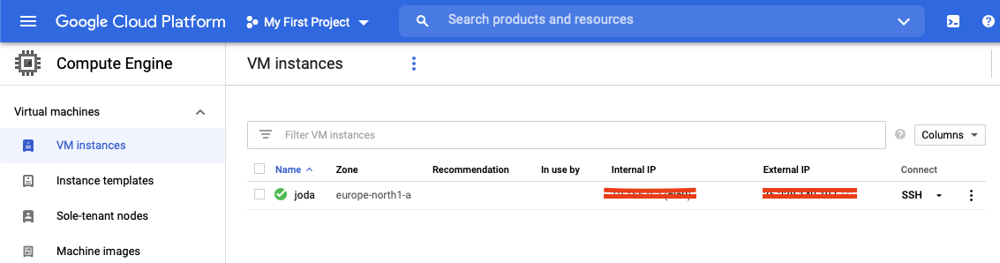
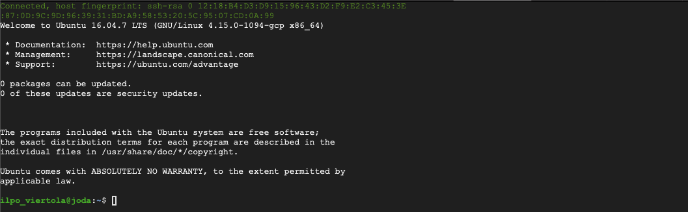
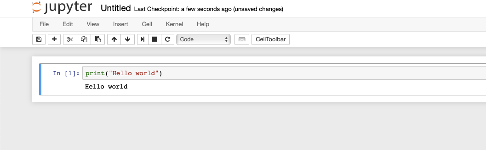
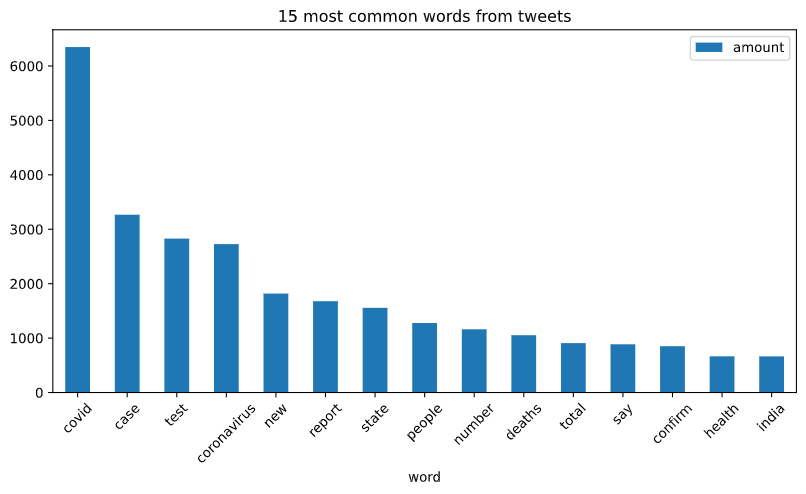
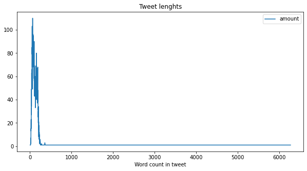

# Harjoitustyö
### *Ilpo Viertola, Johdanto datatieteeseen 2021, tavoiteltu pistemäärä: 2-3*

## Osa 1
### Google Cloud Platform
Päätin toteuttaa työn kehitysympäristön hyödyntäen Google Cloud Platformia. GCP vaatii Google-tilin ja sinne ensi kertaa kirjautuessa uudet käyttäjät saavat käyttöönsä 300$. Käytin apuna [täältä löytyvää ohjetta.](https://tudip.com/blog-post/run-jupyter-notebook-on-google-cloud-platform/). Käydään kuitenkin pääkohdat läpi tässä:

1. Kirjautumisen jälkeen tulee luoda uusi virtuaalikone instanssi *Compute engine -kohdasta*. Alla kuva VM:n asetuksista:
<p style="text-align:center;"><p />

2. Tämän jälkeen luotu VM näkyy vastaavanlaisesti:
<p style="text-align:center;"><p />

3. Vaihdetaan virtuaalikoneen IP-osoite staattiseksi. Tämä helpottaa sen käyttöä, kun ei aina tarvitse onkia uutta IP-osoitetta. Tietysti tietorurvallisempaa olisi käyttää dynaamista IP-osoitetta...
<p style="text-align:center;"><p />

4. Muutetaan palommuriasetuksia:
    - Klikkaa VM-instanssin perästä kolmesta pisteestä -> network details
    - Vasemmalta valikosta Firewall -> Create firewall rule
    - Määritä IP, josta yhteydet sallitaan
    - Määritä TCP porttinumero (esim. 5002), johon yhteydet sallitaan

5. Käynnistetään SSH-yhteys virtuaalikoneelle. Seuraava näkymä aukeaa selaimeen:
<p style="text-align:center;"><p />

6. Asennetaan Anaconda virtuaalikoneelle. Sen mukana tulee myös muita hyödyllisiä Python-paketteja, kuten Jupyter Notebook, Pandas yms. Tämä onnistuu komennolla:
```
wget https://repo.continuum.io/archive/Anaconda3-4.2.0-Linux-x86_64.sh
bash Anaconda3-4.2.0-Linux-x86_64.sh
```

7. Luodaan ja avataan Jupyter Notebook konfigurointi tiedosto. Tämä onnistuu esim VIM-editorilla.
```
jupyter notebook --generate-config
vim ~/.jupyter/jupyter_notebook_config.py
```

8. Lisätään siihen rivit:
```
c = get_config()
c.NotebookApp.ip = '*'
c.NotebookApp.open_browser = False
c.NotebookApp.port = <PORTTI-NRO-KOHDASTA-4>
```

9. Käynnistetään Jupyter Notebook serveri virtuaalikoneella:
```
jupyter notebook
```

10. Siirry selaimella osoitteeseen: http//:<VM:n IP-osoite>/<määritetty portti>. Luo uusi Jupyter Notebook -tiedosto. Alla kuva omasta ympäristöstäni:
<p style="text-align:center;"><p />

### Versionhallinta ja koodien jakaminen
Käytetään versionhallintaan ja koodien jakamiseen Git:iä ja GitHubia. Koska Git:n käyttö ei kurssin ydinasiaan liity, en käy sitä tarkemmin. Gitin asennusohjeet komentoriviltä löytyvät kuintekin [git-scm.com sivulta.](https://git-scm.com/book/en/v2/Getting-Started-Installing-Git) Enemmän ohjeita löytyy esimerkiksi [täältä.](https://docs.github.com/en/github/getting-started-with-github/quickstart)

### Hyödyllisien linkkien yhteenveto
1. [GCP-ohjeet](https://tudip.com/blog-post/run-jupyter-notebook-on-google-cloud-platform/)
2. [Gitin asennus](https://git-scm.com/book/en/v2/Getting-Started-Installing-Git)
3. [Git ohjeita](https://docs.github.com/en/github/getting-started-with-github/quickstart)


### Helppoa ja vaikeaa
1. Asiat olivat ennestään tuttuja, joten vaikeuksia ei ollut.
2. Tietoa löytyy runsaasti netistä.
3. GCP palvelu on helppo käyttöinen.

## Osa 2

Tässä harjoitustyön osassa käyn lävitse, kuinka keräsin työssä käytetyn datasetin. Datasetit hain kahdesta eri lähteestä:  
1. Kagglen tarjoama valmis datasetti  
2. Twitter API:n ja Tweepyn avulla itse kerätty datasetti  

### Kagglen tarjoama datasetti
  
Käytetyn datasetin löytää [täältä](https://www.kaggle.com/elvinagammed/covid19-fake-news-dataset-nlp/code). Tämä datasetti koostuu eri sosiaalisen median kanavista kerätyistä englannin kielisistä julkaisuista, jotka sisältävät Koronavirukseen liittyvää informaatiota. Datasetti myös sisältää tiedon siitä, onko julkaisun informaatio paikkaansa pitävää. Tämän datasetin avulla pyrin harjoitustyön seuraavissa vaiheissa opettamaan luokittelijan, joka osaa tunnistaa väärää Koronavirus informaatiota sisältävät julkaisut. Käytän tästä datasetistä pääsääntöisesti kahta eri tiedostoa harjoitustyön seuraavissa vaiheissa:  
  
1. Constraint_Train.csv: Sisältää opetusdatan.  
2. Constraint_Test.csv: Sisältää testidatan.  
  
### Tweepyn avulla kerätty datasetti
  
Käytin Pythonin Tweepy kirjastoa, joka suoraviivaistaa Twitter API:n käyttöä. Twitter API mahdollistaa esimerkiksi twiittien reaaliaikaisen hakemisen Twitteristä ohjelmakoodissa. Tämän kerätyn datasetin avulla pyrin koeponnistamaan tekemääni mallia reaalimaailmassa, eli luokittelemaan satunnaisia twiittejä. Twiitit, joita työssä käytän ovat englannin kielisiä ja sisältävät #covid19-tagin. Näin voidaan olettaa, että twiitin sisältö liittyy edes jotenkin koronaviirukseen. On mielenkiintoista nähdä, miten luokittelija käyttäytyy heikommin kuratoiduille syötteille. Alla on esitettynä Python-koodi, jota twiittien hakemiseen käytin.   


```python
import tweepy
import pandas as pd

# Autentikointi Twitteriin
consumer_key = ''
consumer_secret = ''
access_key = ''
access_key_secret = ''

auth = tweepy.OAuthHandler(consumer_key, consumer_secret)
auth.set_access_token(access_key, access_key_secret)
api = tweepy.API(auth)  # Rajapinta

# Luodaan DataFrame twiiteille
tweet_df = pd.DataFrame(columns=['username', 'description', 'location', 'following', 'followers', 'totaltweets', 'retweetcount', 'text', 'hashtags'])

# Tweepyn Cursor-objektille annetaan parametrina api.search-metodi ja haun parametrit. 
# Rajoitetaan haettavien twiittien määrä esim. 50:neen.
hashtag = '#covid19'
d_since = '2021-04-07'
limit = 50
tweets = tweepy.Cursor(api.search, q=hashtag, lang='en', since=d_since, tweet_mode='extended').items(limit)

# Cursor palauttaa iteroitavat objektin, joten iteroidaan sen sisältö listaan.
tweets_list = [tweet for tweet in tweets]

# Käydään läpi twiitit listasta.
for tweet in tweets_list:
    # Tietoja twiitistä ja twiittaajasta myöhempään tarkasteluun
    username = tweet.user.screen_name
    description = tweet.user.description
    location = tweet.user.location
    following = tweet.user.friends_count
    followers = tweet.user.followers_count
    totaltweets = tweet.user.statuses_count
    retweetcount = tweet.retweet_count
    hashtags = tweet.entities['hashtags']
        
    # Uudelleentwiittaukset voidaan erottaa retweeted_status-määritteellä.
    # Jos twiitti ei ole retwiitti, except-lohko suoritetaan.
    try:
        text = tweet.retweeted_status.full_text
    except AttributeError:
        text = tweet.full_text
    hashtext = list()
    for j in range(0, len(hashtags)):
        hashtext.append(hashtags[j]['text'])
        
    # Lisätään data DataFrameen.
    ith_tweet = [username, description, location, following, followers, totaltweets, retweetcount, text, hashtext]
    tweet_df.loc[len(tweet_df)] = ith_tweet

# Rivien määrä sama kuin asetettu raja.
print('Amount of tweets: ' + str(len(tweet_df)))
# Katsaus muutamaan ensimmäiseen riviin.
tweet_df.head()
```

    Amount of tweets: 50

<div>
<table border="1" class="dataframe">
  <thead>
    <tr style="text-align: right;">
      <th></th>
      <th>username</th>
      <th>description</th>
      <th>location</th>
      <th>following</th>
      <th>followers</th>
      <th>totaltweets</th>
      <th>retweetcount</th>
      <th>text</th>
      <th>hashtags</th>
    </tr>
  </thead>
  <tbody>
    <tr>
      <th>0</th>
      <td>Sampath1986</td>
      <td>Filmmaker, Indian cinema</td>
      <td>Chennai, India</td>
      <td>919</td>
      <td>161</td>
      <td>52645</td>
      <td>4</td>
      <td>#Lucknow\nNeed #Blood Type :  O-negative\nAt :...</td>
      <td>[Lucknow, Blood, COVID19]</td>
    </tr>
    <tr>
      <th>1</th>
      <td>DbAshby</td>
      <td>Brexit is a disaster for the UK economy #Brexi...</td>
      <td>Cheshire</td>
      <td>6259</td>
      <td>5986</td>
      <td>303793</td>
      <td>243</td>
      <td>"Vaccines alone will not be able to protect us...</td>
      <td>[COVID19]</td>
    </tr>
    <tr>
      <th>2</th>
      <td>SEEP_Fiji</td>
      <td>People. Centred. Development. \nReal DEMOCRACY</td>
      <td>Suva,  Fiji</td>
      <td>197</td>
      <td>241</td>
      <td>1273</td>
      <td>0</td>
      <td>Demystify all the fear mongering around the #C...</td>
      <td>[COVID19, vaccine]</td>
    </tr>
    <tr>
      <th>3</th>
      <td>yodisculpe</td>
      <td>27 🇲🇽 \nAlways hungry/always tired. Wear a mas...</td>
      <td>L.A.</td>
      <td>218</td>
      <td>14</td>
      <td>5964</td>
      <td>109</td>
      <td>L.A. PEOPLE: Just checked and there are some #...</td>
      <td>[COVID19]</td>
    </tr>
    <tr>
      <th>4</th>
      <td>SOUMYA_PAL24</td>
      <td></td>
      <td></td>
      <td>0</td>
      <td>0</td>
      <td>52</td>
      <td>52</td>
      <td>Doing online meeting to secure themselves and ...</td>
      <td>[Examwarrior]</td>
    </tr>
  </tbody>
</table>
</div>

### Hyödyllisiä linkkejä
1. [Kagglen datasetti](https://www.kaggle.com/elvinagammed/covid19-fake-news-dataset-nlp?select=Constraint_Test.csv)
2. [Tweepyn dokumentaatio](https://docs.tweepy.org/en/latest/index.html)
3. [Geeks4Geeks esimerkki](https://www.geeksforgeeks.org/extracting-tweets-containing-a-particular-hashtag-using-python/)

### Helppoa ja haastavaa
1. Kagglesta hyvän ja ajankohtaisen datasetin etsiminen saattaa vaati hieman aikaa.  
2. Tweepy oli täysin uusi tuttavuus, joten sen omaksuminen otti aikansa.  
3. Twitter API:n datankeräys katot aiheuttivat välillä päänvaivaa. 

## Osa 3

Tässä harjoitustyöraportin osassa käydään lävitse, kuinka dataa jalostettiin ja twiiteistä eroteltiin piirteet. Tätä dataa tullaan myöhemmin käyttämään neuroverkossa, jonka tekemiseen hyödynnetään Pythonin Keras-kirjastoa. Valittu koneoppimisen menetelmä vaikuttaa vahvasti siihen, miten dataa tullaan käsittelemään. 

### Datan siivoaminen
  
Lähtökohtana oli neljä Pandas DataFramea, jotka sisälsivät käsittelemätöntä dataa. Kolme näistä sisälsivät Kagglesta haettua dataa ja yksi Twitter API:n kautta kerättyjä #covid19-tagillä varustettuja twiittejä. Kagglen datasetteihin lukeutuu mallin opetukseen, validointiin ja testaukseen kätetyt datasetit, jotka sisältävät covid19-aiheisia sosiaalisen median julkaisuja. Kaikille julkaisuille on myös määritetty totuusarvo, onko tekstin uutinen/väittämä totta vai tarua. Mallin toimivuutta reaalimaailmassa on tarkoitus testata Twitter API:lla kerätyn datasetin avulla.
  
Aivan ensimmäisenä tarkastetaan, sisältävätkö datasetit Null-arvoja ja onko kolumnien datatyypit kunnossa. Alla muutamia koodipätkiä, joilla työ on tehty. En ole tähän dokumenttiin kirjannut operaatioita kuin kahdelle datasetille, koska ne ovat samankaltaisia myös muille.

```python
print('Null values in training data? ' + str(train_df.isnull().values.any()))
print('Null values in Twitter data? ' + str(tweet_df.isnull().values.any()))
```
    Null values in training data? False
    Null values in Twitter data? False

```python
print('Datatypes for training data: \n' + str(train_df.dtypes) + '\n')
print('Datatypes for Twitter data: \n' + str(tweet_df.dtypes) + '\n')
```

    Datatypes for training data: 
    id        int64
    tweet    object
    label    object
    dtype: object
    
    Datatypes for Twitter data: 
    username        object
    description     object
    location        object
    following       object
    followers       object
    totaltweets     object
    retweetcount    object
    text            object
    hashtags        object
    dtype: object

Twitter API:n avulla haettu datasetti (tweet_df) vaatii hieman datatyyppien muuntelua.

```python
tweet_df = tweet_df.astype({'following': 'int32', 'followers': 'int32', 'totaltweets': 'int32', 'retweetcount': 'int32'})
print('New datatypes for Twitter data: \n' + str(tweet_df.dtypes) + '\n')
```

    New datatypes for Twitter data: 
    username        object
    description     object
    location        object
    following        int32
    followers        int32
    totaltweets      int32
    retweetcount     int32
    text            object
    hashtags        object
    dtype: object

Twiitit sisältävät tyypillisesti emojeita, linkkejä, viittauksia toisiin käyttäjiin ja hashtageja. Nämä pitää siistiä, ennen kuin sanoista luodaan featureita ja mallia aletaan opettamaan. Ennen tätä siivousta, katsotaan kuitenkin mitä opetus- ja validointidatasettien label-kolumnit pitävät sisällään.

```python
print('Training data labels: \n', train_df['label'].value_counts())
print('\nValidation data labels: \n', val_df['label'].value_counts())
```

    Training data labels: 
    real    3360
    fake    3060
    Name: label, dtype: int64
    
    Validation data labels: 
    real    1120
    fake    1020
    Name: label, dtype: int64

Datasetit ovat hyvin balanssissa. Nämä tekstimuotoiset arvot pitää kuitenkin binäärikoodata jatkoa varten.

Datasetit olivat yllättävän puhtaita. Mitään isompaa siivoamista ei sinänsä tarvinnut tehdä. Seuraavaksi katsaus jalostusvaiheeseen.

### Datan jalostaminen

Edellä huomattiin muutamia jalostustarpeita, kuten tekstin siistimisen tarve ja label-kolumnin binäärikoodaus. Tässä osiossa on muutamia koodiotteita siitä, miten jalostus on totetutettu.

Ensimmäisenä siivotaan twiitit. Poistetaan twiiteistä väli- ja erikoismerkit, kuten pisteet, sulut, pilkut yms. Poistetaan twiiteistä myös yleiset sanat, ns. stopwordit, kuten 'me', 'you', where' yms. Poistetaan myös kaikki linkit, viittaukset toisiin käyttäjiin sekä emojit. Muutetaan sanat myös perusmuotoisiksi ***WordNetLemmatizer()***-metodilla. Alla funktio, jolla tämä on toteutettu.

```python
def tweet_cleaner(tweets):
    for i in range(0, len(tweets)):
        tweet = tweets[i]

        emoji_pattern = re.compile(pattern = '['
            u'\U0001F600-\U0001F64F'  # emoticons
            u'\U0001F300-\U0001F5FF'  # symbols & pictographs
            u'\U0001F680-\U0001F6FF'  # transport & map symbols
            u'\U0001F1E0-\U0001F1FF'  # flags (iOS)
                           ']+', flags = re.UNICODE)

        tweet = html.unescape(tweet)    # Remove leftover HTML elements
        tweet = re.sub(r'@\w+', ' ', tweet) # Remove mentions to other people
        tweet = re.sub(r'http\S+', ' ', tweet)  # Remove links
        tweet = emoji_pattern.sub(r'', tweet)   # Remove emojis
        
        tweet = ''.join([punc for punc in tweet if not punc in puncs])   # Remove punctuation
        tweet = tweet.lower()   # Lowercase text
    
        tweetWord = tweet.split()   # Split to words

        lemmatiser = WordNetLemmatizer()
        tweetWord = [lemmatiser.lemmatize(word, pos='v') for word in tweetWord] # Lemmatize words

        tweets[i] = ''.join([word + ' ' for word in tweetWord if not word in stopws]) # Exclude stopwords
        
    return tweets 
```
  
Siivoamisen tuloksena twiitit, jotka sisälsivät esim. vain linkin, ovat tyhjiä. Poistetaan dataseteistä rivit, joissa siivottu twiitti on tyhjä merkkijono.

```python
train_df['clean_tweet'].replace('', np.nan, inplace=True)
train_df.dropna(subset=['clean_tweet'], inplace=True)
```

Binäärikodaataan validointi- ja opetusdatasettien label-kolumnin real ja fake arvot. Real = 1 ja fake = 0. Tämä totuusarvo tarkoittaa, onko twiitti totta vai tarua.

```python
train_df['is_real'] = pd.get_dummies(train_df['label'])['real']
val_df['is_real'] = pd.get_dummies(val_df['label'])['real']
val_df.head()
```
Katsaus validointidatasettiin jalostustoimenpiteiden jälkeen:
<div>
<table border="1" class="dataframe">
  <thead>
    <tr style="text-align: right;">
      <th></th>
      <th>id</th>
      <th>tweet</th>
      <th>label</th>
      <th>clean_tweet</th>
      <th>is_real</th>
    </tr>
  </thead>
  <tbody>
    <tr>
      <th>0</th>
      <td>1</td>
      <td>Chinese converting to Islam after realising th...</td>
      <td>fake</td>
      <td>chinese convert islam realise muslim affect co...</td>
      <td>0</td>
    </tr>
    <tr>
      <th>1</th>
      <td>2</td>
      <td>11 out of 13 people (from the Diamond Princess...</td>
      <td>fake</td>
      <td>11 13 people diamond princess cruise ship inti...</td>
      <td>0</td>
    </tr>
    <tr>
      <th>2</th>
      <td>3</td>
      <td>COVID-19 Is Caused By A Bacterium, Not Virus A...</td>
      <td>fake</td>
      <td>covid19 cause bacterium virus treat aspirin</td>
      <td>0</td>
    </tr>
    <tr>
      <th>3</th>
      <td>4</td>
      <td>Mike Pence in RNC speech praises Donald Trump’...</td>
      <td>fake</td>
      <td>mike pence rnc speech praise donald trump’s co...</td>
      <td>0</td>
    </tr>
    <tr>
      <th>4</th>
      <td>5</td>
      <td>6/10 Sky's @EdConwaySky explains the latest #C...</td>
      <td>real</td>
      <td>610 sky explain latest covid19 data government...</td>
      <td>1</td>
    </tr>
  </tbody>
</table>
</div>

Koska neuroverkot eivät tyypillisesti käytä merkkijonoja syötteinään, on datasettejä jalostettava edelleen. Jokaiselle uniikille sanalle twiiteissä on määritettävä oma kokonaislukuarvo. Näistä kokonaisluvuista luodaan lista (sequence), jossa luvut ovat samassa järjestyksessä kuin niitä edustavat sanat ovat siivotussa twiitissä. Neuroverkon syötteiden on oltava samanmittaisia. Tämän vuoksi liian lyhyiden twiittien kokonaislukulistat pitää täydentää nollilla vastaamaan syötteelle asetettua pituutta.

Alla koodi, jolla tämä on tehty. Muuttuja *all_clean* pitää sisällään kaikki (10760) siivottua twiittiä.

```python
tokenizer = Tokenizer()
tokenizer.fit_on_texts(all_clean) # Map words to integers

def tokenize_tweet(tweets):
    texts = tokenizer.texts_to_sequences(tweets) # Convert clean_tweet to sequence of integers.
    texts = pad_sequences(texts, padding='post', maxlen=875) # Pad the sequences with 0s so lenghts match.
    return texts

```

```python
texts_train = tokenize_tweet(train_df["clean_tweet"].copy()) # Collect the tweet sequences
train_df["tweet_sequence"] = list(texts_train)
train_df.head()
```

Katsaus opetusdatasettiin:
<div>
<table border="1" class="dataframe">
  <thead>
    <tr style="text-align: right;">
      <th></th>
      <th>id</th>
      <th>tweet</th>
      <th>label</th>
      <th>clean_tweet</th>
      <th>real</th>
      <th>is_real</th>
      <th>tweet_sequence</th>
    </tr>
  </thead>
  <tbody>
    <tr>
      <th>0</th>
      <td>1</td>
      <td>The CDC currently reports 99031 deaths. In gen...</td>
      <td>real</td>
      <td>cdc currently report 99031 deaths general disc...</td>
      <td>1</td>
      <td>1</td>
      <td>[94, 199, 6, 8697, 10, 649, 4643, 89, 401, 378...</td>
    </tr>
    <tr>
      <th>1</th>
      <td>2</td>
      <td>States reported 1121 deaths a small rise from ...</td>
      <td>real</td>
      <td>state report 1121 deaths small rise last tuesd...</td>
      <td>1</td>
      <td>1</td>
      <td>[7, 6, 8699, 10, 650, 135, 47, 1044, 2487, 7, ...</td>
    </tr>
    <tr>
      <th>2</th>
      <td>3</td>
      <td>Politically Correct Woman (Almost) Uses Pandem...</td>
      <td>fake</td>
      <td>politically correct woman almost use pandemic ...</td>
      <td>0</td>
      <td>0</td>
      <td>[4644, 1155, 391, 473, 37, 23, 2488, 3889, 198...</td>
    </tr>
    <tr>
      <th>3</th>
      <td>4</td>
      <td>#IndiaFightsCorona: We have 1524 #COVID testin...</td>
      <td>real</td>
      <td>indiafightscorona 1524 covid test laboratories...</td>
      <td>1</td>
      <td>1</td>
      <td>[19, 8700, 14, 3, 211, 16, 3017, 213, 42, 5947...</td>
    </tr>
    <tr>
      <th>4</th>
      <td>5</td>
      <td>Populous states can generate large case counts...</td>
      <td>real</td>
      <td>populous state generate large case count look ...</td>
      <td>1</td>
      <td>1</td>
      <td>[5948, 7, 2112, 441, 2, 401, 194, 5, 2, 100, 5...</td>
    </tr>
  </tbody>
</table>
</div>

Lopuksi voidaan vielä varmistaa, että tekstin palauttaminen normaaliksi merkkijonoksi onnistuu:

```python
print('Some clean tweet:', train_df['clean_tweet'][300])
print('Same tweet\'s encoded sequence:', train_df['tweet_sequence'][300])
print('Sequence transformed back to normal text:', tokenizer.sequences_to_texts([train_df['tweet_sequence'][300]]))
```

    Some clean tweet: new numerous covid19 outbreaks recent cruise ship voyage extend previous sail order prevent spread covid19 among crew onboard 
    
    Same tweet's encoded sequence: [   5 6109    1  646  371 1328  820 8993  893  755 4773  275  141   31 1  367 2546 6110 ... 0    0    0]
    
    Sequence transformed back to normal text: ['new numerous covid19 outbreaks recent cruise ship voyage extend previous sail order prevent spread covid19 among crew onboard']

Jokainen sana, eli twiitin piirre, on halutussa muodossa, jotta malli voidaan tämän datasetin avulla opettaa. Myös opetus- ja validointidatasetin real ja fake arvot ovat binäärikoodattu mallia varten, joten mallin rakentamisen voi aloittaa.

### Hyödyllisiä linkkejä
1. [Esimerkki Jupyter Notebook](https://www.kaggle.com/lunamcbride24/covid19-tweet-truth-analysis)
2. [YouTube-video aiheesta](https://www.youtube.com/watch?v=j7EB7yeySDw)
3. [Hyvä blogipostaus](https://www.exxactcorp.com/blog/Deep-Learning/getting-started-with-nlp-using-the-tensorflow-and-keras-frameworks)

### Helppoa ja vaikeaa
1. En ole ennen toteuttanut NLP:tä käyttäen neuroverkkoja, joten datan jalostaminen oli hieman erilainen prosessi.
2. Twiittien siivousfunktion hiominen otti yllättävän paljon aikaa.
3. Googlettamalla tietoa tästä aiheesta löytyy paljon.

## Osa 4
Tässä harjoitustyön osassa otetaan lyhyt katsaus käytettyihin datasetteihin. Tässä raportissa olevat kuvaajat ovat muodostettu yhdistetylle datasetille, joka sisältää kaikki twiitit. Datan kuvaileminen on erityisen tärkeää myös NLP-työssä. Tämä auttaa vahvistamaan tulokset siitä, että datan esikäsittely on oikeasti onnistunut ja esimerkiksi kaikki poikkeamat, jotka on haluttu teksteistä poistaa, ovat oikeasti poissa. Myös usein esiintyvät sanat ovat kiinnostavia. Tätä silmäilyä varten yhdistin kaikki esikäsitellyt twiitit yhdeksi datasetiksi. Tämän datasetin exportoin Excel-taulukoksi, jota silmäilemällä huomasin, että kaikki Emojit eivät olleet poistuneet datasta. Tämän johdosta päivitin datan siivoukseen käyttämääni funktiota ja exportoin twiitit uudestaan varmistuakseni siitä, että siivoaminen oli onnistunut. 

### Sanojen kokonaismäärä

Alla olevassa kuvaajassa on 15 suosituinta sanaa. Suosituin sana on 'covid19', joka ei yllätä sillä datasetit koostuvat koronavirus-uutisista.
```python
print('The total number of words: ', len(tokenizer.word_index) + 1)
word_amnts = pd.DataFrame(columns=['word', 'amount'])
for i, (word, count) in enumerate(tokenizer.word_counts.items()):
    word_amnts.loc[i] = [word, count]
word_amnts = word_amnts.astype({'amount':'int32'})
word_amnts = word_amnts.sort_values(by='amount', axis=0, ascending=False)
```

    The total number of words:  18511

```python
amnt_plot = word_amnts[:15].plot(x='word', y='amount', figsize=(10,5), title='15 most common words from tweets')
plt.xticks(ticks=np.arange(15), labels=word_amnts['word'][:15], rotation=45)
```
    

    
### Luokkien painotus opetusdatassa

Alla olevasta graafista voidaan tulkita, että opetusdata on hyvin tasaisesti painottunut molempien luokkien suhteen. Tämä on hyvä lähtökohta mallin opettamiselle. Sama päti myös validointidatalle. Alla olevalla koodinpätkällä olen tuottanut graafin.

```python
train_df['label'].value_counts().sort_values(ascending=True).plot(kind='barh', figsize=(10,5))
```


### TF-IDF-arvot datasetille

TF-IDF eli Term Frequency - Inverse Document Frequency painottaa termin, eli sanan, yleisyyttä (TF) ja sen käänteistä yleisyyttä kaikissa dokumenteissa (IDF). Mitä korkeampi TF-IDF arvo on, sitä harvinaisempi sana on datasetissä. Korkean TF-IDF arvon omaavat termit ovat kuvaavampia kuin matalan TF-IDF arvon omaavat termit. Alla olevassa kuvaajassa on esitetty 10 korkeimman TF-IDF arvon omaavaa termiä. TF-IDF arvoja katsellessa ensimmäisen kerran huomasin, että tekstit sisäsivät numero-arvoja. Päätin poistaa nämä ainakin aluksi, koska en kokenut niiden olleen hirveän merkittäviä sellaisenaan.

```python
tfIdfVectorizer=TfidfVectorizer(use_idf=True)
tfIdf = tfIdfVectorizer.fit_transform(all_clean)
tfIdf_df = pd.DataFrame(tfIdf[0].T.todense(), index=tfIdfVectorizer.get_feature_names(), columns=['TF-IDF %'])
tfIdf_df['word'] = tfIdfVectorizer.get_feature_names()
tfIdf_df = tfIdf_df.sort_values('TF-IDF %', ascending=False)
tfIdf_df[:10].plot(figsize=(10,5), title='10 words with largest TF-IDF values')
plt.xticks(ticks=np.arange(10), labels=tfIdf_df['word'][:10], rotation=45)
```

    

    


### Twiittien pituudet

Seuraavaksi otetaan katsaus twiittien pituuksiin. Alla oleva kuvaajassa twiitit on jaoteltu pituuksittain. Suurin osa twiitteistä on noin 100-150 sanan pituisia. Kuitenkin myös yli 6000 sanan twiitti löytyy joukosta. On mielenkiintoista nähdä, miten luokittelija toimii pidemmälle syötteelle.


```python
tweet_lens = {}

for tweet in all_clean:
    length = len(tweet)
    if length in tweet_lens.keys():
        tweet_lens[length] += 1
    else:
        tweet_lens[length] = 1

tweet_lens_df = pd.DataFrame.from_dict(tweet_lens, orient='index', columns=['amount'])
tweet_lens_df = tweet_lens_df.sort_index()
tweet_lens_df.plot(figsize=(10,5), title='Tweet lenghts')
plt.xlabel('Word count in tweet')
```
    

    
```python
tweet_lens_df[:150].plot(figsize=(10,5), title='150 first tweet lenghts')
plt.xlabel('Word count in tweet')
```
    

    


### Bigrammit

Bigrammi koostuu kahdesta sanasta, jotka esiintyvät twiitissä peräkkäin. Datasettejä voitaisiin muokata niin, että ei operoitaisi yhdellä sanalla, vaan piirteinä käytettäisiin bigrammeja. Alla olevassa kuvaajassa on 15 eniten esiintyvää bigrammia koko datasetissä.


```python
bigrams_all = {}
bigrams_freq = []

for tweet in all_clean:
    bgs = ngrams(tweet.split(), 2)

    for bg in bgs:
        bigrams_freq.append(bg)
        bg = str(bg[0]) + "_" + str(bg[1])
        if bg not in bigrams_all.keys():
            bigrams_all[bg] = 1
        else:
            bigrams_all[bg] += 1

bigrams_all_df = pd.DataFrame.from_dict(bigrams_all, orient='index', columns=['amount'])
bigrams_all_df = bigrams_all_df.astype({'amount':'int32'})
bigrams_all_df['bigrams'] = bigrams_all_df.index
bigrams_all_df = bigrams_all_df.sort_values(by='amount', axis=0, ascending=False)
bigrams_all_df[:15].plot(figsize=(10,5), title='15 most common bigrams')
plt.xticks(ticks=np.arange(15), labels=bigrams_all_df['bigrams'][:15], rotation=90)
plt.xlabel('Bigrams')
```
    


### Helppoa ja vaikeaa
1. Oli haastavaa keksiä hyviä kuvaajia dataseteille.
2. Datasettien kuvaajien tekeminen oli välillä yllättävän haastavaa.
3. Listassa olleet siivotut twiitit helpottivat työtä.

### Hyödyllisiä linkkejä
1. [Joitain NLP-kuvaajia](https://medium.com/plotly/nlp-visualisations-for-clear-immediate-insights-into-text-data-and-outputs-9ebfab168d5b)

## Osa 5

ässä harjoitustyön osassa otetaan lyhyt katsaus siihen, miten kehitin twiittien totuusarvoa ennustavan neuroverkon hyödyntäen TensorFlown Keras-kirjastoa. Erityisesti tässä osiossa olen hyödyntänyt paljon esimerkkejä, kuitenkin laajemmin tätä Jupyter Notebookkia: https://www.kaggle.com/lunamcbride24/covid19-tweet-truth-analysis.

### Mallin luominen
Tämä vaihe vaati paljon hyperparametrien säätelyä. Jouduin myös palaamaan takaisin ja säätämään käyttämäni Keras-kirjaston Tokenizer()-funktion parametetrejä. Tämä vaihe myös vahvisti uumoiluni siitä, että numeroarvojen käyttäminen ei olisi mielekästä. Validointivaiheessa huomasin, että opetusdata, joka ei ollut sisältänyt numeroarvoja tuotti paremman mallin kuin opetusdata joka näitä sisälsi. Alla on esitettynä Python-koodi, jota mallin luomiseen käytin. Kokonaisuudessaan mallin opettaminen käyttäen koko opetusdataa kesti noin 30 minuuttia. Opetuksen päätyttyä sain lupaavat tulokset häviöksi: **0.0928** ja tarkkuudeksi: **0.9721**. Todellisuudessa malli punnitaan vasta validointi- ja testausvaiheessa.

```python
size = len(tokenizer.word_index) + 1
tf.keras.backend.clear_session()

epoch = 3
batchSize = 32
outputDimensions = 16
units = 256

model = tf.keras.Sequential([
    L.Embedding(size, outputDimensions, input_length=texts_train.shape[1]),
    L.Bidirectional(L.LSTM(units, return_sequences=True)),
    L.GlobalMaxPool1D(),
    L.Dropout(0.3),
    L.Dense(64, activation="relu"),
    L.Dropout(0.3),
    L.Dense(3)
])


model.compile(loss = SparseCategoricalCrossentropy(from_logits=True),
              optimizer='adam', metrics=['accuracy'])

history = model.fit(texts_train, train_df['is_real'], epochs=epoch, validation_split=0, batch_size=batchSize)
```
  

### Mallin validointi
Validointidata sisältää siis dataa, jota malli ei ole ennen nähnyt. Validointidata sisältää myös tiedon siitä, onko kyseinen twiitti totta vai tarua. Tällöin voidaan määrittää, kuinka oikeellisia tuloksia malli tuottaa. Alla esitetyn koodinpätkän avulla ajoin mallin validointidatalle.

```python
predict = model.predict_classes(texts_val)
loss, accuracy = model.evaluate(texts_val, val_df["is_real"])

print("Validation Loss: ", loss)
print("Validation Accuracy: ", accuracy)
```

    2140/2140 [==============================] - 51s 24ms/sample - loss: 0.2732 - acc: 0.9117
    Validation Loss:  0.273237350736266
    Validation Accuracy:  0.91168225

Mallin tarkkuus validointidatalle on siis noin 91%. Olen tähän tyytyväinen. Otetaan katsaus Pandasin DataFrameen, joka sisältää todenmukaisen totuusarvon (is_real), ennustetun totuusarvon (predictions) ja twiitin.

<table border="1" class="dataframe">
  <thead>
    <tr style="text-align: right;">
      <th></th>
      <th>is_real</th>
      <th>predictions</th>
      <th>tweet</th>
    </tr>
  </thead>
  <tbody>
    <tr>
      <th>0</th>
      <td>0</td>
      <td>0</td>
      <td>Chinese converting to Islam after realising that no muslim was affected by #Coronavirus #COVD19 in the country</td>
    </tr>
    <tr>
      <th>1</th>
      <td>0</td>
      <td>0</td>
      <td>11 out of 13 people (from the Diamond Princess Cruise ship) who had intially tested negative in tests in Japan were later confirmed to be positive in the United States.</td>
    </tr>
    <tr>
      <th>2</th>
      <td>0</td>
      <td>0</td>
      <td>COVID-19 Is Caused By A Bacterium, Not Virus And Can Be Treated With Aspirin</td>
    </tr>
    <tr>
      <th>3</th>
      <td>0</td>
      <td>0</td>
      <td>Mike Pence in RNC speech praises Donald Trump’s COVID-19 “seamless” partnership with governors and leaves out the president's state feuds: https://t.co/qJ6hSewtgB #RNC2020 https://t.co/OFoeRZDfyY</td>
    </tr>
    <tr>
      <th>4</th>
      <td>1</td>
      <td>1</td>
      <td>6/10 Sky's @EdConwaySky explains the latest #COVID19 data and government announcement. Get more on the #coronavirus data here👇 https://t.co/jvGZlSbFjH https://t.co/PygSKXesBg</td>
    </tr>
    <tr>
      <th>...</th>
      <td>...</td>
      <td>...</td>
      <td>...</td>
    </tr>
    <tr>
      <th>2135</th>
      <td>0</td>
      <td>0</td>
      <td>Donald Trump wrongly claimed that New Zealand had a “big surge” in COVID-19 cases on a day when the country reported nine new cases. The U.S. has reported more than 50000 new cases per day for most of July and August. https://t.co/y3QsWUj23I</td>
    </tr>
    <tr>
      <th>2136</th>
      <td>1</td>
      <td>1</td>
      <td>Current understanding is #COVID19 spreads mostly from person to person through respiratory droplets produced when a person coughs or sneezes similar to how flu spreads. Learn more at https://t.co/VvIzx7O3mM https://t.co/MiHHHyCfTa</td>
    </tr>
    <tr>
      <th>2137</th>
      <td>0</td>
      <td>0</td>
      <td>Nothing screams “I am sat around doing fuck all during lockdown” quite like confident assumption that other people are sat around doing fuck all during lockdown https://t.co/Hs3rZAAl1h</td>
    </tr>
    <tr>
      <th>2138</th>
      <td>0</td>
      <td>0</td>
      <td>Birx says COVID-19 outbreak not under control because ‘people are on the move’ https://t.co/YFqi6f7Rvj</td>
    </tr>
    <tr>
      <th>2139</th>
      <td>1</td>
      <td>1</td>
      <td>Another 4422 new coronavirus cases have been confirmed in the UK - the highest daily number since 8 May. It's up from 4322 new cases reported on Friday and the overall total nationwide now stands at 385936. Read the latest here: https://t.co/1TYdoRZ9Yr https://t.co/96F7njc7sM</td>
    </tr>
  </tbody>
</table>
</div>

Katsotaan esimerkkejä twiiteistä, jolle malli tuotti väärän totuusarvon.

<table border="1" class="dataframe">
  <thead>
    <tr style="text-align: right;">
      <th></th>
      <th>is_real</th>
      <th>predictions</th>
      <th>tweet</th>
    </tr>
  </thead>
  <tbody>
    <tr>
        <th>2104</th>
        <td>0</td>
        <td>1</td>
        <td>From June 26 Taipei Veterans General Hospital implements strict access control including a ban on patients visits. The local transmission in Taiwan is worse than what the Taiwan health ministry reported.</td>
    </tr>
    <tr>
        <th>2107</th>
        <td>1</td>
        <td>0</td>
        <td>ICYMI: Deborah Birx 3/8/20 White House Briefing: “I know many of you are watching the [Covid] Act Now model and the IHME model from — and they have consistently decreased the number...That is modeled on what America is doing. That’s what’s happening.” https://t.co/IDhKGPjgWB</td>
    </tr>
    <tr>
        <th>2121</th>
        <td>1</td>
        <td>0</td>
        <td>Mayor of Greater Manchester Andy Burnham says the prime minister needs to listen to people on a regional level more for a "greater sense of national unity" going forward. He adds #COVID19 testing in his region was "chaotic". #KayBurley https://t.co/I0Ya5YFTvZ https://t.co/OgDEgdHZuu</td>
    </tr>
  </tbody>
</table>
</div>

Näistä twiiteistä myös minun olisi vaikea sanoa, ovatko ne oikeasti totta vai tarua. 

### Mallin ajaminen testidatalle
Testidata ei sisällä tietoa oikeasta totuusarvosta, eikä malli ole ennen nähnyt testidataa. Katsotaan muutamia saatuja tuloksia ja arvoidaan niiden oikeellisuutta. Alla olevassa taulukossa kolumni is_real kertoo mallin tuottaman totuusarvon tweet-kolumnissa näkyvälle twiitille.

<table border="1" class="dataframe">
  <thead>
    <tr style="text-align: right;">
      <th></th>
      <th>is_real</th>
      <th>tweet</th>
    </tr>
  </thead>
  <tbody>
    <tr>
      <th>0</th>
      <td>1</td>
      <td>Our daily update is published. States reported 734k tests 39k new cases and 532 deaths. Current hospitalizations fell below 30k for the first time since June 22. https://t.co/wzSYMe0Sht</td>
    </tr>
    <tr>
      <th>1</th>
      <td>0</td>
      <td>Alfalfa is the only cure for COVID-19.</td>
    </tr>
    <tr>
      <th>2</th>
      <td>0</td>
      <td>President Trump Asked What He Would Do If He Were To Catch The Coronavirus https://t.co/3MEWhusRZI #donaldtrump #coronavirus</td>
    </tr>
    <tr>
      <th>3</th>
      <td>1</td>
      <td>States reported 630 deaths. We are still seeing a solid national decline. Death reporting lags approximately 28 days from symptom onset according to CDC models that consider lags in symptoms time in hospital and the death reporting process. https://t.co/LBmcot3h9a</td>
    </tr>
    <tr>
      <th>4</th>
      <td>1</td>
      <td>This is the sixth time a global health emergency has been declared under the International Health Regulations but it is easily the most severe-@DrTedros https://t.co/JvKC0PTett</td>
    </tr>
  </tbody>
</table>
</div>

Rivillä 0 oleva twiitti saattaa hyvinkin olla totta.  
Rivillä 1 oleva twiitti on selvästi väärää informaatiota. Tämän malli on tajunnut, jes!  
Rivillä 2 olevan twiitin totuusarvoa on vaikea määrittää, koska se ei sisällä mitään väittämää.  
Rivillä 3 oleva twiitti on The COVID Tracking Projectin (etsin ja tarkistin) julkaisema ja saattaa hyvinkin olla tosi.  
Rivillä 4 oleva twiitti on WHO:n julkaisema (etsin ja tarkistin). Tämän voi olettaa olevan siis tosi.  

Lyhyellä silmäilyllä malli näyttää suoriutuvan ihan hyvin testidatasta. Testidata oli siis Kagglen datasetistä, joten on mielenkiintoista katsoa, miten malli suoriutuu "todellisista" twiiteistä, jotka on julkaistu #covid19-tunnisteella. Suurin ero tämän testidatasetin ja "todellisen" datasetin välillä on, että twiitit on haettu TwitterAPI:n avulla ja niitä ei ole kuratoitu. Ne saattavat sisältää siis mitä vain. Lisää tästä seuraavassa raportissa.

### Hyödyllisiä linkkejä
1. [Jupyter Notebook esimerkki](https://www.kaggle.com/lunamcbride24/covid19-tweet-truth-analysis)
2. [Keras dokumentaatio](https://www.tensorflow.org/api_docs/python/tf/keras)

### Helppoa ja vaikeaa
1. Oikeiden parametrien löytäminen mallille on haastavaa. Niitä voisi optimoida ja viilailla loputtomiin.
2. Pandasin käyttö alkaa vihdoin sujua. Se helpottaa harjoitustyön tekemistä.
3. Testidatan tuloksia on hidasta analysoida, koska varmaa oikeaa tietoa ei ole.

## Osa 6
Tässä raportin osassa esittelen tuloksia joita sain, kun ajoin luokittelijaani TwitterAPI:n avulla haetulle datasetille. Tämä datasetti piti sisällään twiittejä, joissa oli #covid19-tunniste. Otetaan ensimmäisenä katsaus datasettiin.

### Katsaus Twitter-datasettiin

Alla olevassa taulukossa on 32 twiittiä, joille luokittelijaa ajettiin. Kokonaisuudessaan luokiteltavia twiittejä oli noin kuusikymmentä. Datasetti sisältää myös muita tietoja, kuten twiittaajan nimen ja sijainnin (kaikki data ei näy tässä raportissa olevassa taulussa). Tätä dataa ei tässä työssä niinkään käytetty, mutta saattaa kehitys- ja analysointimielessä olla erittäin mielekästä. Sen takia olen jättänyt sen datasettiin.  
  
Datasetin twiitit eivät kaikki sisällä väitteitä koronaviiruksesta. Tällaiselle datalle on vaikeaa tuottaa mitään totuusarvoa. On kiinnostavaa nähdä myös tulokset datalle, joka sisältää numeerista statistiikkaa, koska numerot on siivottu tekstin esikäsittelyssä.

<div>
<table border="1" class="dataframe">
  <thead>
    <tr style="text-align: right;">
      <th></th>
      <th>username</th>
      <th>location</th>
      <th>text</th>
      <th>hashtags</th>
      <th>clean_tweet</th>
    </tr>
  </thead>
  <tbody>
    <tr>
      <th>0</th>
      <td>janastranewseng</td>
      <td>India</td>
      <td>Chandigarh reports 431 new #COVID19 cases, taking the total number of cases to 33,309</td>
      <td>[COVID19]</td>
      <td>chandigarh report new covid case take total number case</td>
    </tr>
    <tr>
      <th>1</th>
      <td>Koernerr</td>
      <td>Deerfield, IL</td>
      <td>Cold, Sunny, and Pandemically Affected https://t.co/t2MOIJurLn. Cannot wait to be able to spend more time outside. #confinement #covid19 #coronavirus</td>
      <td>[confinement, covid19, coronavirus]</td>
      <td>cold sunny pandemically affect cannot wait able spend time outside confinement covid coronavirus</td>
    </tr>
    <tr>
      <th>2</th>
      <td>janastranewseng</td>
      <td>India</td>
      <td>Jammu and Kashmir reports 1145 new #COVID19 positive cases; 503 from Jammu division and 642 from Kashmir division.\n\nTotal positive cases: 145166\nTotal discharges: 132205\nDeaths: 2051\nActive cases: 10910 https://t.co/4WRbf2ncgZ</td>
      <td>[COVID19]</td>
      <td>jammu kashmir report new covid positive case jammu division kashmir division total positive case total discharge deaths active case</td>
    </tr>
    <tr>
      <th>3</th>
      <td>News_Updates_24</td>
      <td></td>
      <td>#Goa reports 762 new #COVID19 positive cases and 4 deaths\n\nNumber of active cases stand at 6643.</td>
      <td>[Goa, COVID19]</td>
      <td>goa report new covid positive case deaths number active case stand</td>
    </tr>
    <tr>
      <th>4</th>
      <td>MrGladPortBlair</td>
      <td>Andaman Nicobar Islands, India</td>
      <td>Ostriches of @Andaman_Admin report 1 more death &amp;amp; 42 more people #COVID19 positive, 31 contacts; 11 flyers, Saturday. Discharge 36, total 5331, Dead 64, active 121.\n \nContinue to mislead people by describing recovered patients as "total CURED 5146".\n\n• Hawk Eye\nPort Blair</td>
      <td>[COVID19]</td>
      <td>ostriches report death people covid positive contact flyers saturday discharge total dead active continue mislead people describe recover patients total cure • hawk eye port blair</td>
    </tr>
    <tr>
      <th>5</th>
      <td>shovas</td>
      <td>Canada</td>
      <td>"31 of Ontario's 44 municipal and regional police services have rejected the province's arbitrary detention and questioning powers"\n\nThank you for protecting our liberties Ontario Police!\n\n@fordnation @RodPhillips01 @mayor_collier #covid19 #onhealth #onpoli #EndTheLockdowns https://t.co/uEFC7LFMBz</td>
      <td>[covid19, onhealth, onpoli, EndTheLockdowns]</td>
      <td>ontarios municipal regional police service reject provinces arbitrary detention question power thank protect liberties ontario police covid onhealth onpoli endthelockdowns</td>
    </tr>
    <tr>
      <th>6</th>
      <td>News_Updates_24</td>
      <td></td>
      <td>#Karnataka: BJP candidate Pratap Gowda Patil, who has tested positive for #COVID19, casts his vote in bypoll for #Maski Assembly constituency in #Raichur district. https://t.co/3g9L9D7bKr</td>
      <td>[Karnataka, COVID19, Maski, Raichur]</td>
      <td>karnataka bjp candidate pratap gowda patil test positive covid cast vote bypoll maski assembly constituency raichur district</td>
    </tr>
    <tr>
      <th>7</th>
      <td>Jelliffe_Pawlow</td>
      <td>San Franciso, CA</td>
      <td>How is this responsible public health w/o vaccination? Every seat ⁦@UnitedAirlines⁩ ? OMG! Still people bitching about masks ... really? Restaurants at 25% but flights - 100% - 6 feet distancing until in the plane - craziest stupid thing ever - so disappointed #covid19 @cdc https://t.co/zjAIzlNadT</td>
      <td>[covid19]</td>
      <td>responsible public health wo vaccination every seat ⁦ ⁩ omg still people bitch mask really restaurants flight feet distance plane craziest stupid thing ever disappoint covid</td>
    </tr>
    <tr>
      <th>8</th>
      <td>idlaboha</td>
      <td>New Jersey</td>
      <td>What is a #COVID19 #vaccine #passport , and will you need one? 4 things to know. Passports will create 2-tier society. Exclusivity will prevail. Haves and have nots. End of American #democracy . https://t.co/lXZ7sGsBB8</td>
      <td>[COVID19, vaccine, passport, democracy]</td>
      <td>covid vaccine passport need one things know passports create tier society exclusivity prevail nots end american democracy</td>
    </tr>
    <tr>
      <th>9</th>
      <td>BagBiker</td>
      <td>St Louis, terra, sol, milkyway</td>
      <td>Cuteness for the afternoon... #servicedog #DogsofTwittter \n\nEveryone enjoys cuddles, have you cuddled someone today? Social animals need cuddles to work properly otherwise they short circuit. GET YOUR CUDDLES! #COVID19 it is proven good for your health.😉#fact https://t.co/N4EEeOJf92</td>
      <td>[servicedog, DogsofTwittter, COVID19, fact]</td>
      <td>cuteness afternoon servicedog dogsoftwittter everyone enjoy cuddle cuddle someone today social animals need cuddle work properly otherwise short circuit get cuddle covid prove good healthfact</td>
    </tr>
    <tr>
      <th>10</th>
      <td>MerlinofCanada</td>
      <td>Canada</td>
      <td>@gregbd You will notice @francoisLegault never mentions that 1 in 5 cases of #Covid19 in Quebec is a child. https://t.co/YBrszPAeQ1</td>
      <td>[Covid19]</td>
      <td>notice never mention case covid quebec child</td>
    </tr>
    <tr>
      <th>11</th>
      <td>QuimSegales</td>
      <td></td>
      <td>The golden Syrian hamster is and has been a tremendous treasure for the development of animal models to study #SARSCoV2 and #COVID19. Definitively it deserves a great credit within this deadly #pandemia. https://t.co/KJXPJMIywc</td>
      <td>[SARSCoV2, COVID19, pandemia]</td>
      <td>golden syrian hamster tremendous treasure development animal model study sarscov covid definitively deserve great credit within deadly pandemia</td>
    </tr>
    <tr>
      <th>12</th>
      <td>4elegantly</td>
      <td></td>
      <td>4ELEGANTLY #style #love #usa #paris #fashion #store #london #luxury #beauty #madrid #covid19 #kids #clothes #shose https://t.co/2zHt7xICZm</td>
      <td>[style, love, usa, paris, fashion, store, london, luxury, beauty, madrid, covid19, kids, clothes, shose]</td>
      <td>elegantly style love usa paris fashion store london luxury beauty madrid covid kid clothe shose</td>
    </tr>
    <tr>
      <th>13</th>
      <td>thomas_tong1</td>
      <td></td>
      <td>@BogochIsaac One more is strong to enface indoor activities #COVID19 measure - absent</td>
      <td>[COVID19]</td>
      <td>one strong enface indoor activities covid measure absent</td>
    </tr>
    <tr>
      <th>14</th>
      <td>SaanyaChopraDua</td>
      <td>Los Angeles, CA</td>
      <td>If u haven’t read this thread read it now.\nHave been saying this is a Plandemic created to Depopulate the world.\n\nWake Up &amp;amp; stop ur herd mentality nonsense &amp;amp; see what’s really happening.\n\n#COVID19 #COVID19Vaccine \n#SCAMDEMIC2021 #Truth \nSSR Was Brutally Murdered https://t.co/G89e2BJeir</td>
      <td>[COVID19, COVID19Vaccine, SCAMDEMIC2021, Truth]</td>
      <td>u haven’t read thread read say plandemic create depopulate world wake stop ur herd mentality nonsense see what’s really happen covid covidvaccine scamdemic truth ssr brutally murder</td>
    </tr>
    <tr>
      <th>15</th>
      <td>kuwaittimesnews</td>
      <td>Kuwait</td>
      <td>COVID death toll passes 3 million as cases surge https://t.co/XXzna2hjD2 via @kuwaittimesnews \n#COVID19 #COVIDdeathtoll #coronavirus https://t.co/ShZLjs4if3</td>
      <td>[COVID19, COVIDdeathtoll, coronavirus]</td>
      <td>covid death toll pass million case surge via covid coviddeathtoll coronavirus</td>
    </tr>
    <tr>
      <th>16</th>
      <td>ChiapasMayan</td>
      <td>Chiapas, México</td>
      <td>The first stage of the application of the second dose of the vaccine against COVID-19 concludes in Tuxtla Gutiérrez. Vaccines will continue to arrive to continue with the second stage of this immunization process for people over 60 years of age. #covid19 #vaccination https://t.co/dG3iNEXMqw</td>
      <td>[covid19, vaccination]</td>
      <td>first stage application second dose vaccine covid conclude tuxtla gutiérrez vaccines continue arrive continue second stage immunization process people years age covid vaccination</td>
    </tr>
    <tr>
      <th>17</th>
      <td>reppinca</td>
      <td>Windsor, Ont. Can.</td>
      <td>WPD has put a presence in the park to prevent a gathering of this groups protest....\n\nhttps://t.co/8nLFsWMzmB\n\nNice to see common sense applied...\n\n#covid19\n#onpoli</td>
      <td>[covid19, onpoli]</td>
      <td>wpd put presence park prevent gather group protest nice see common sense apply covid onpoli</td>
    </tr>
    <tr>
      <th>18</th>
      <td>findingsfacts</td>
      <td>India</td>
      <td>Delhi records over 24,000 #COVID19 on Saturday; CM Arvind Kejriwal says Delhi is short on Oxygen, Remdesivir</td>
      <td>[COVID19]</td>
      <td>delhi record covid saturday cm arvind kejriwal say delhi short oxygen remdesivir</td>
    </tr>
    <tr>
      <th>19</th>
      <td>Gratian_DSouza</td>
      <td>धारावी भेट, मुंबई, भारत</td>
      <td>Those Praising #UPCM #YogiAdityanath &amp;amp; Trolling #MahaCM #UddhavThackeray Should Realise the Fact that the Majority of #Covid19 cases are of Migrants from #UttarPradesh #Bihar &amp;amp; #MadhyaPradesh  residing in my #Maharashtra</td>
      <td>[UPCM, YogiAdityanath, MahaCM, UddhavThackeray, Covid19, UttarPradesh, Bihar, MadhyaPradesh, Maharashtra]</td>
      <td>praise upcm yogiadityanath troll mahacm uddhavthackeray realise fact majority covid case migrants uttarpradesh bihar madhyapradesh reside maharashtra</td>
    </tr>
    <tr>
      <th>20</th>
      <td>jandws</td>
      <td>England</td>
      <td>Is it more unethical to expose people to #Coronavirus infection?\n#Covid19: #VaccinePassports 'unethical', church leaders warn\nhttps://t.co/t8PLJEpJFZ</td>
      <td>[Coronavirus, Covid19, VaccinePassports]</td>
      <td>unethical expose people coronavirus infection covid vaccinepassports unethical church leaders warn</td>
    </tr>
    <tr>
      <th>21</th>
      <td>ymediagroup</td>
      <td>Canada</td>
      <td>2,065 Ontarians hospitalized, with 726 getting treated in ICU\n#ymedia #covid19 #ontario https://t.co/Riodo6luLe</td>
      <td>[ymedia, covid19, ontario]</td>
      <td>ontarians hospitalize get treat icu ymedia covid ontario</td>
    </tr>
    <tr>
      <th>22</th>
      <td>prbtwitts</td>
      <td>Chicago, IL</td>
      <td>#COVID19 #COVID19India \n\nConfirmed - 1,47,62,351\nActive - 17,86,490\nRecovered - 1,27,92,687\nDeceased - 1,76,978</td>
      <td>[COVID19, COVID19India]</td>
      <td>covid covidindia confirm active recover decease</td>
    </tr>
    <tr>
      <th>23</th>
      <td>MarySUSY12345</td>
      <td></td>
      <td>Despite #Covid19 pandemic, Palestinian prisoners have not been provided with hygiene and sanitation products, and have been further restricted from making purchases from the prison canteen.\n#PalestinianPrisonersDay</td>
      <td>[Covid19, PalestinianPrisonersDay]</td>
      <td>despite covid pandemic palestinian prisoners provide hygiene sanitation products restrict make purchase prison canteen palestinianprisonersday</td>
    </tr>
    <tr>
      <th>24</th>
      <td>janastranewseng</td>
      <td>India</td>
      <td>Goa reports 762 new #COVID19 positive cases and 4 deaths\n\nNumber of active cases stand at 6643 https://t.co/eefnhSdRND</td>
      <td>[COVID19]</td>
      <td>goa report new covid positive case deaths number active case stand</td>
    </tr>
    <tr>
      <th>25</th>
      <td>anukasan1977</td>
      <td>Fredericksburg, VA</td>
      <td>#COVID19 #lockdown: end it.\n\nGo back to normal life, with people free to make their own risk assessments.\n\nYes, governments should help those in vulnerable demographics who choose to isolate. But that's a separate issue from mandates.\n\nhttps://t.co/exVIDkyuYH https://t.co/pWxo45Gotr</td>
      <td>[COVID19, lockdown]</td>
      <td>covid lockdown end go back normal life people free make risk assessments yes governments help vulnerable demographics choose isolate thats separate issue mandate</td>
    </tr>
    <tr>
      <th>26</th>
      <td>LuvishJain</td>
      <td>Baran, Rajasthan</td>
      <td>Corona Vaccine - What if govt. Pays evry1 their ITR total income in their bank n asks them to stay quite for 15-20days at home😂\nResults- corona stoppage,no business Loss, no controversies from amng traders/asso etc #corona #covid19 #Indiacorona  #CoronaSecondWave #CoronaVaccine</td>
      <td>[corona, covid19, Indiacorona, CoronaSecondWave, CoronaVaccine]</td>
      <td>corona vaccine govt pay evry itr total income bank n ask stay quite days home result corona stoppageno business loss controversies amng tradersasso etc corona covid indiacorona coronasecondwave coronavaccine</td>
    </tr>
    <tr>
      <th>27</th>
      <td>New Delhi, India</td>
      <td>India’s health system has collapsed \nBy: ⁦@BDUTT⁩ \n#Covid19  https://t.co/i67yGO9pfj</td>
      <td>[Covid19]</td>
      <td>india’s health system collapse ⁦ ⁩ covid</td>
    </tr>
    <tr>
      <th>28</th>
      <td>sdbaral</td>
      <td>Here</td>
      <td>@thelungdr @TorontoIDDoc @zchagla @BogochIsaac @MPaiMD @wick_22 @IrfanDhalla The counterfactual to people hanging out outdoors is them socializing indoors outside of the view of both the public and the police.\n\nAs we tweet, there are outdoor events that were moved indoors potentiating the risks of #COVID19 transmission.\n\nhttps://t.co/qtaX93ZQ2X</td>
      <td>[COVID19]</td>
      <td>counterfactual people hang outdoors socialize indoors outside view public police tweet outdoor events move indoors potentiate risk covid transmission</td>
    </tr>
    <tr>
      <th>29</th>
      <td>outbreak_india</td>
      <td>Malaysia</td>
      <td>17-Apr: #Jharkhand #COVID19 update\n\nActive Cases: 25,619 (+2,574)\n\nTotal Cases: 1,58,953 (+3,838)\nTotal Recovered: 1,31,928 (+1,234)\nTotal Deaths: 1,406 (+30)\nTotal Tests: 63,68,644 (+40,990)\nPositivity Rate: 2.50% (9.36%) https://t.co/9ByY9QzHmj</td>
      <td>[Jharkhand, COVID19]</td>
      <td>apr jharkhand covid update active case total case total recover total deaths total test positivity rate</td>
    </tr>
    <tr>
      <th>30</th>
      <td>wetcoastdaily</td>
      <td>Gibsons, British Columbia</td>
      <td>The latest The Wet Coast Daily! https://t.co/E607jPYkSP Thanks to @thestaredmonton @Unifor2000 @PeterboroLive #covid19 #pandemic</td>
      <td>[covid19, pandemic]</td>
      <td>latest wet coast daily thank covid pandemic</td>
    </tr>
    <tr>
      <th>31</th>
      <td>TazeenQureshy</td>
      <td>Odisha</td>
      <td>Second wave #COVID19 #Odisha update -\n\n- Night Curfew begins in Odisha (including #Bhubaneswar and #Cuttack)\n\n- Weekend shutdown in 10 districts close to #Chhattisgarh\n\n- Government asks district administration to pay special attention to #KumbhMela returnees. https://t.co/mNqAToyNoB</td>
      <td>[COVID19, Odisha, Bhubaneswar, Cuttack, Chhattisgarh, KumbhMela]</td>
      <td>second wave covid odisha update night curfew begin odisha include bhubaneswar cuttack weekend shutdown district close chhattisgarh government ask district administration pay special attention kumbhmela returnees</td>
    </tr>
  </tbody>
</table>
</div>


### Ennustaminen
Alla olevalla koodinpäätkällä ajoin mallin yllä esitetylle datalle sekä loin ennustuksista uuden DataFramen vertailua varten. 

```python
tweet_preds = model.predict_classes(texts_tweets)
tweet_preds = ['real' if pred == 1 else 'false' for pred in tweet_preds] # Un-dummy label

tweet_preds_df = tweet_df["text"].copy() # Get the original tweets
tweet_preds_df = pd.DataFrame(tweet_preds_df)
tweet_preds_df["prediction"] = tweet_preds
tweet_preds_df = tweet_preds_df[["prediction", "text"]]
tweet_preds_df.to_csv(csv_path + '/modified_datasets/tweets_with_preds.csv')
tweet_preds_df.head()
```


<div>
<table border="1" class="dataframe">
  <thead>
    <tr style="text-align: right;">
      <th></th>
      <th>prediction</th>
      <th>text</th>
    </tr>
  </thead>
  <tbody>
    <tr>
      <th>0</th>
      <td>real</td>
      <td>Chandigarh reports 431 new #COVID19 cases, taking the total number of cases to 33,309</td>
    </tr>
    <tr>
      <th>1</th>
      <td>false</td>
      <td>Cold, Sunny, and Pandemically Affected https://t.co/t2MOIJurLn. Cannot wait to be able to spend more time outside. #confinement #covid19 #coronavirus</td>
    </tr>
    <tr>
      <th>2</th>
      <td>false</td>
      <td>Jammu and Kashmir reports 1145 new #COVID19 positive cases; 503 from Jammu division and 642 from Kashmir division.\n\nTotal positive cases: 145166\nTotal discharges: 132205\nDeaths: 2051\nActive cases: 10910 https://t.co/4WRbf2ncgZ</td>
    </tr>
    <tr>
      <th>3</th>
      <td>real</td>
      <td>#Goa reports 762 new #COVID19 positive cases and 4 deaths\n\nNumber of active cases stand at 6643.</td>
    </tr>
    <tr>
      <th>4</th>
      <td>real</td>
      <td>Ostriches of @Andaman_Admin report 1 more death &amp;amp; 42 more people #COVID19 positive, 31 contacts; 11 flyers, Saturday. Discharge 36, total 5331, Dead 64, active 121.\n \nContinue to mislead people by describing recovered patients as "total CURED 5146".\n\n• Hawk Eye\nPort Blair</td>
    </tr>
  </tbody>
</table>
</div>

Rivillä kaksi oleva twiitti on Asian News Internatinalin twiittaama. Pienellä googlailulla selviää, että tili on ennenkin syyllistynyt väärän Koronavirusinformaation levittämiseen. Toisaalta, tämä twiitti voi hyvin pitää paikkansa. Luokittelija ei myöskään ota kantaa numeroihin, joten niiden perusteella väärän informaation leimaa ei ole tullut. 

### Mallin testailu varmasti oikeaa/väärää informaatiota sisältäville twiiteille
Tässä osiossa kokeillaan, millaisia tuloksia malli tuottaa varmasti oikeaa tai väärää informaatiota sisältäville twiiteille. Olen poiminut twiitit käsin ja ajanut mallin niille.

#### Twiitti nro 1
*Brains behind new 5G data communications networks described below! New Bill Gates sponsored corona virus vaccine, w/nano tech, will run everything and control everyone who are still necessary, like bots to serve the elite? Get your vaccine now?*  
  
Twiitti sisältää selvästi väärää informaatiota ja olin myös Twitterin merkkaama. Myös malli ennusti, että tämä twiitti ei ole paikkaansa pitävä.

#### Twiitti nro 2
*We are #InThisTogether to beat #COVID19 - tip* 3️⃣ :

*Maintain at least a 1-metre* 📏  *distance between yourself & others. Maintain an even greater distance when indoors. The further away, the better.*

*Staying safe:*  
✅ *protects you*  
✅ *protects others*
  
Tämä on World Health Organization julkaisema twiitti. Informaatio on siis paikkaansa pitävää. Myös malli antoi tälle twiitille oikean luokan. Ennustus on siis onnistunut.  
  
#### Twiitti nro 3
*Israel has lifted the mandatory requirement to wear face masks outdoors and fully reopened its education system following its mass vaccination drive.*

*This comes after Israel’s speedy inoculation of a majority of its population in a world-leading vaccination campaign*  
  
Tämä twiitti on Bloombergin twiittama ja on tosi. Informaatio on todella tuoretta (19.4.2021), joten on kiinnostavaa katsoa minkä totuusarvon malli tuottaa tälle datalle. Malli tuotti tälle twiitille väärän totuusarvon. Malli ennusti twiitin sisältävän väärää informaatiota. Enemmän pohdiskelua tästä Pohdintaa ja kehitysideoita kappaleessa.  

#### Twiitti nro 4
*Flu season is coming up! Many people every year, sometimes over 100,000, and despite the Vaccine, die from the Flu. Are we going to close down our Country? No, we have learned to live with it, just like we are learning to live with Covid, in most populations far les lethal!!!*  

Tämä on Donald Trumpin twiittaama twiitti, jonka Twitter sekä Facebook poistivat. Informaatio on siis väärää. Onneksi tämän twiitin luokitteluun ei kätetty malliani, koska sen tuottama tulos oli väärä. 

Neljästä käsin valitusta twiitistä kahdelle saatiin ennustettua oikea luokka. Tämä ei ole paljon kolikonheittoa parempi, mutta otanta on myös pieni. Toisaalta, malli vaatii kehitystä, jotta sitä voitaisiin käyttää todellisessa maailmassa. 

### Pohdintaa ja kehitysideoita
On vaikeaa varmistaa, onko luokittelijan tulos oikea. Joissain tapauksissa se on selvää, mutta esimerkiksi numeerisen statistiikan oikeellisuuden selvittäminen on työlästä. Toisaalta, numeerisen statistiikan tarkastamiseen NLP-malli ei ole mielestäni oikea ratkaisu. Mallin opettamiseen käytetyllä datasetillä on myös suuri vaikutus mallin toimintaan. Parempia tuloksia olisi varmasti saatu ajankohtaisemmalla ja laajemmalla datasetillä. Koronavirustilanne muuttuu jatkuvasti ja tämän vuoksi liian vanhan opetusdatan käyttäminen saattaa aiheuttaa väärää luokittelua ajankohtaisille twiiteille. Opetukseen käyttämäni datasetti oli julkaistu 12.3.2021.  

Kuten mainittu, opetusdatalla on valtava merkitys siihen, mitä tuloksia malli tuottaa. Mallin pitäminen ajantasalla vaatisi opetusdatasetin jatkuvaa päivittämistä sekä mallin opettamista uudelleen tai sitten jotain muita keinoja oikeiden tuloksien varmistamiseksi uusille uutisille.
  
Tekstin esikäsittelyä voisi myös muokata. Esimerkiksi voisi tutkia, tuottavatko emojit lisäarvoa tässä luokittelussa. Itse olen siivonnut ne pois.
  
Vaikka validointidatalle malli tuotti jopa yllättävän hyviä tuloksia, on kuitenkin selvää että oikeassa maailmassa käytettäväksi tämä on liian keskeneräinen. Eräs kehitysidea oli hyödyntää n-grammeja piirteinä yksittäisten sanojen sijaan. Myös mallia voisi monimutkaistaa lisäämällä siihen lisää kerroksia. 
  
Olisin halunnut julkaista yksinkertaisen web-applikaation, jolle olisi voinut syöttää twiittejä. Tämä twiitti olisi sitten luokiteltu tällä mallilla. "Oikeiden" töiden vuoksi aika on kuitenkin rajallinen ja tämä jääköön tulevaisuuteen.


### Käyttökohteita
Tätä mallia voisi hyödyntää esimerkiksi sosiaalisen median postauksien tarkistajana (vaikka vaatisi hieman kehitystä ennen sitä). Tällöin sosiaalisen median palveluntarjoaja voisi varmistua, että heidän käyttäjänsä eivät usko sinisilmäisesti väärää informaatiota. Myös väärää informaatiota levittävät tilit saataisiin kiinni ja tilit voisi jäädyttää. Vääräksi informaatioksi luokitellut COVID19-aiheiset julkaisut voisi siis merkata jollain tunnisteella (niinkuin Twitter tekee).
  
Mallia voisi myös hyödyntää uutissivustoilla. Eri uutissivustoilta voitaisiin hakea Koronavirukseen liittyviä uutisia, uutiset prosessoitaisiin ja luokiteltaisiin mallin avulla. Tällä tavoin saataisiin kiinnostavaa tietoa siitä, mitkä uutissivustot tuottavat väärää informaatiota. Esimerkiksi onko iltapäivälehtien tuottama informaatio aina todenperäistä.
  
### Helppoa ja vaikeaa
1. Mallin käyttäminen on hyvin yksinkertaista.
2. Mallin tuottamien tuloksien analysointi on haastavaa.